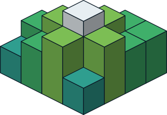

<div align="center">
    
    <br />
    <strong>3D geospatial engine for Bevy</strong>
    <br />
    <br />
</div>


**Bevytiles** is a 3D geospatial engine 🌎 for [Bevy](https://bevy.org/). Designed to stream and render the real
world in real time. It lets you visualize any location on Earth directly inside your Bevy games and applications.

---

Geo-spatial terrain streaming for [Bevy](https://bevyengine.org) — a Rust port of
[raytiles](https://github.com/ziv/raytiles). Streams satellite imagery, Terrarium heightmaps, and normal maps around a
moving camera and renders them as GPU-displaced terrain with quadtree LOD, disk caching, terrain
synthesis above the provider zoom ceiling, and O(1) ground-height queries.

The design brief this implements (and the mapping of raytiles concepts onto Bevy's ECS, assets,
visibility system, and materials) lives in `raytiles/docs/bevy.md`.

## Run the demo

```sh
cargo run --example demo
```

Flies over the Grand Canyon. **A/D** roll, **Q/E** yaw, **W/S** pitch, **+/-** throttle, **R** reset after crashing
into the terrain. Tiles cache under `.cache/`; the first run downloads them (Esri imagery serves
JPEG despite the endpoint name — decoding handles both).

### In the browser

```sh
rustup target add wasm32-unknown-unknown
cargo install wasm-server-runner
cargo run --example demo --target wasm32-unknown-unknown   # dev loop, opens on :1334
./web/build.sh                                             # static bundle → web/dist
```

On `wasm32` the tile source uses browser `fetch` on Bevy's task pool instead of threads, and keeps
native-zoom heightmaps in memory instead of a disk cache. Details and caveats in
[`web/README.md`](web/README.md).

## Use as a library

```rust
use bevy::prelude::*;
use bevytiles::prelude::*;

App::new()
    .add_plugins(DefaultPlugins)
    .insert_resource(WorldConfig::from_lat_lon(46.206889, 9.497194)) // the Dolomites
    .add_plugins(TerrainPlugin)
    .add_systems(Startup, |mut c: Commands, w: Res<WorldConfig>| {
        c.spawn((Camera3d::default(), TerrainCamera,
                 Transform::from_translation(w.initial_position(5000.0))));
    })
    .run();
```

Configuration mirrors raytiles: `WorldConfig`, `StreamingConfig`, `RenderingConfig` (runtime
mutable — the plugin syncs materials), `NetworkConfig`. `world.max_zoom` defaults to 15; raising
it (≤ 22) opts into heightmaps synthesized from the native-zoom ancestors and flat default
normals. Large worlds use the raytiles rebase convention via the `TerrainAnchor` resource
(`absolute = user − world_offset`); see the demo's `rebase_large_world`.

## Layout

| module | role |
|---|---|
| `lod` | pure desired-set policy (snapshot-tested — values match the C++ engine exactly) |
| `source` | tile fetching: native = worker threads + HTTP + disk cache; wasm = `fetch` futures + memory cache; decode + synthesis, whole-tile payload channel |
| `store` | ECS systems: reconcile / promote / update_desired / status; one entity per tile |
| `material` + `assets/shaders/terrain.wgsl` | displacement, lighting, fog |
| `synth` | Terrarium float decode / quadrant upsample / carry-safe encode |
| `height` | uint16 height grids + bilinear `ground_height` |

## Bevy compatibility

| bevytiles | bevy |
|---|---|
| 0.1 | 0.19 |

## Notes
- Data: imagery © Esri; elevation/normals from the Mapzen/AWS terrain tiles. Mind their terms.
- `cargo test` runs the full suite (lod snapshots, synthesis math, source integration against
  seeded caches — all offline).

## License

Dual-licensed under either of

- Apache License, Version 2.0 ([LICENSE-APACHE](LICENSE-APACHE) or https://www.apache.org/licenses/LICENSE-2.0)
- MIT license ([LICENSE-MIT](LICENSE-MIT) or https://opensource.org/licenses/MIT)

at your option, matching the Bevy ecosystem convention. Unless you explicitly state otherwise, any
contribution intentionally submitted for inclusion in the work by you shall be dual licensed as
above, without any additional terms or conditions.

The license covers this code only; the map data the demo fetches (Esri imagery, Mapzen/AWS terrain
tiles) is governed by the providers' own terms.
